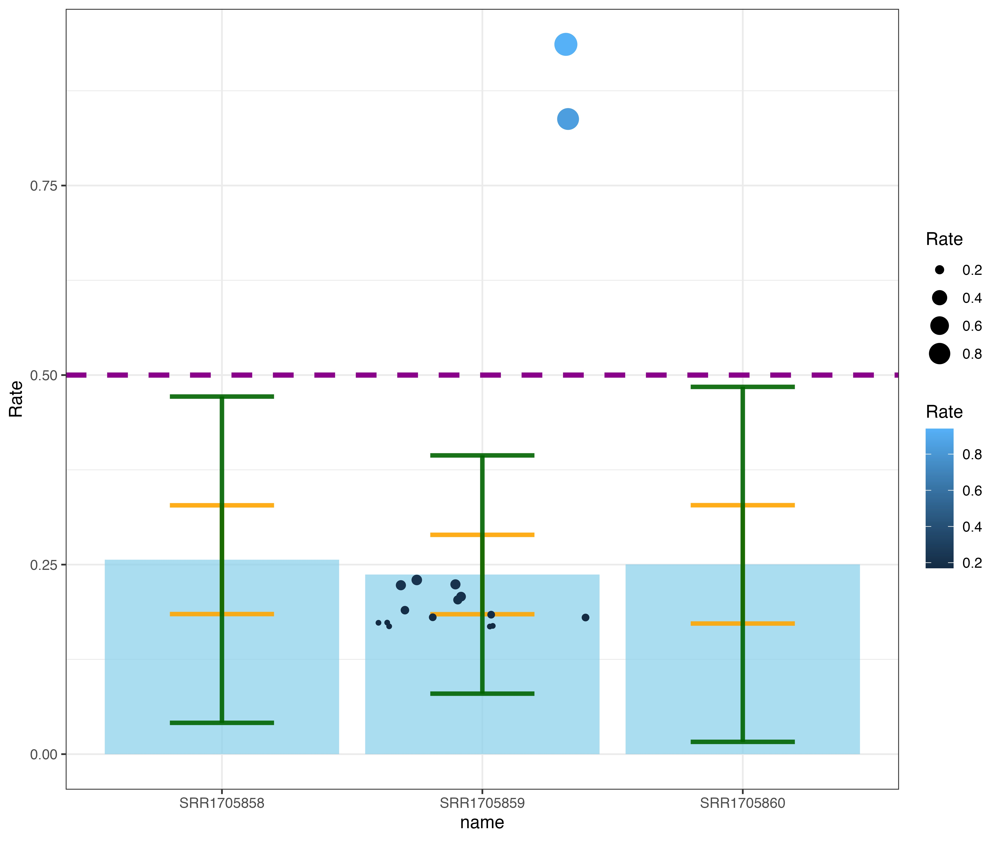
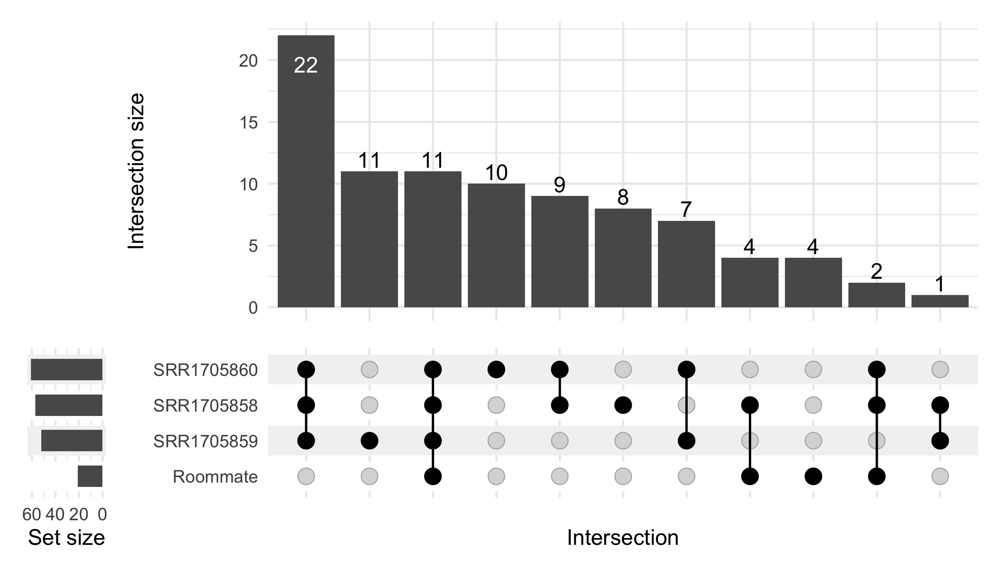
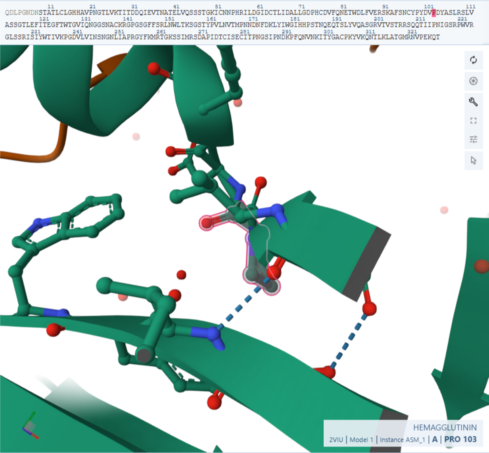

# Decoding Influenza: A Bioinformatics Inquiry into the Mysteries of Flu Infection

Natalia Erofeeva, Shakir Suleimanov

_Bioinformatics Institute_

### Abstract
This study investigates the occurrence of flu infection in an individual vaccinated against the virus, focusing on the potential evolution of the virus through antigenic drift. Utilizing deep sequencing technology, the project analyzes the hemagglutinin gene of the influenza virus from a patient who did not receive the vaccine. The approach includes downloading and aligning viral sequence data with a reference sequence and identifying both common and rare genetic variants using VarScan. Additionally, awk one-liners are employed for efficient data parsing. The research aims to elucidate the mechanisms behind the flu virus's capacity to escape vaccine-induced immunity, highlighting the significance of continuous flu vaccine evaluation and modification. This investigation serves as a practical application of bioinformatics in understanding viral evolution and its implications for vaccine efficacy.

### Methods
BWA MEM and SAMtools were used for alignement and variant calling, respectively. The minimum variant frequency threshold was set at 0.95 (95%) for common variants and 0.001 (0.1%) for rare variants. Pipeline were managed with Snakemake. _ggplot2, dplyr, tidyr, stringr, ComplexUpset_ packages from R programming language were implemented to perform analysis for determination of variants in the patient sample that significantly deviated from those observed in the control samples.

### Results
During bioinformatical ans statistical comparative analysis we distinguished rare mutations in viral genome from sequencing errors by *0.5% cut-off*. We obtained 7 (5 common + 2 rare) mutations in viral sequencing from the patient. 

_Figure 1. Mutations frequency distribution on control samples. Blue barplot represent mean value of mutations frequency. Yellow error bars represent 1σ, green error bars - 3σ. Purple dashed line represents cut-off which is higher than mean + 3σ. Mutations from our patient a represented with circles, where size and color is established according to mutation FREQ (big and shiny dot have higher FREQ)._

A few variants in the patient's sample showed frequencies significantly higher than those observed in the control samples, indicating that these were likely true mutations rather than sequencing artifacts. But it is interesting to observe the intersection of this mutations between control samples and patient. We observed 89 unique mutations from which 11 mutations (12%) are common for patient and control samples. 22 mutations (24%) are common for all control samples, which indicates possible PCR errors due to sample preparation. Other non-common mutations in control sampled might occur due to sequencing errors. All positions with each types of intersections are attached as.

_Figure 2. Mutations intersection between patient and control samples. Numbers on grey bars indicate number of mutations in particular intersection that are pictured below each bar._

Here we provide the list of final mutations which were distinguished from sequencing errors. Further we analyse their impact of the protein structure and functions. It was found that all except one mutations are synonymous, and only C -> T substitution at the 307 postion led to missense mutation and change of Proline to Serine.

| POS | REF | ALT | FREQ | TYPE |
|-----|-----|-----|------|------|
|    COMMON MUTATIONS    |              
|72|A|G | 99.96%| SYN |
|117|C|T|99.82%| SYN |
|774|T|C|99.96%| SYN |
|999|C|T|99.86| SYN |
|1260|A|C|99.94| SYN |
|    RARE MUTATIONS    |  
|307|C|T | 0.94%| MIS |
|1458|T|C|0.84%| SYN |

According to [Munoz et. al.](https://pubmed.ncbi.nlm.nih.gov/15629357/) we have performed epitope mapping. This substitution of Proline to Serine alter epitope D conformation as proline is important for the protein secondary structure. 

### Conclusion
In conclusion, the analysis of the influenza virus from the patient's sample, particularly the mutations in the epitope regions of the HA protein, offers valuable insights into the mechanisms of vaccine escape. The findings underscore the importance of continuous monitoring of influenza virus strains and updating vaccine compositions to account for antigenic drift. Moreover, they highlight the need for advanced methodologies in both laboratory practices and bioinformatics analysis to accurately interpret deep sequencing data.

### Supplement material.

_Supplemental Figure 1. Characterization of number of mutations in all possible positions in control and patient samples_
